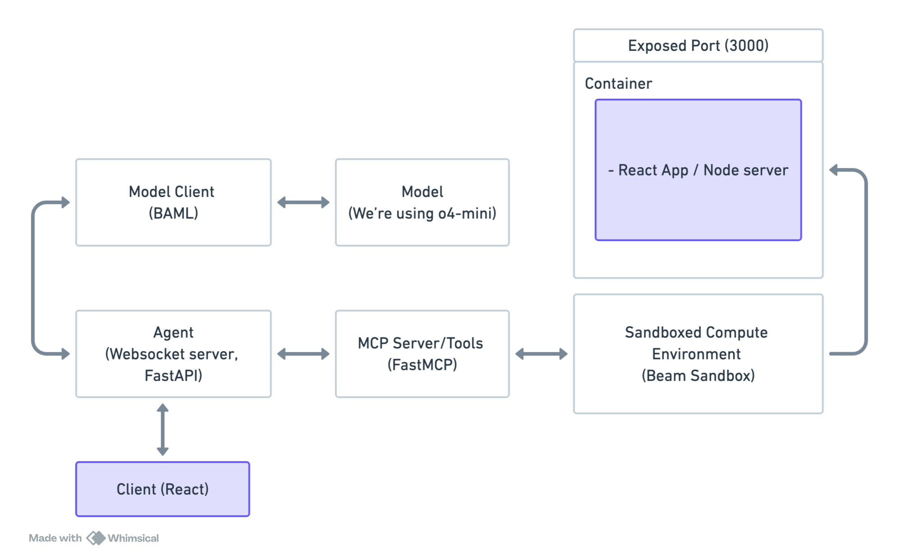

# Lovable Clone - AI-Powered Web App Builder

A real-time AI-powered web application builder inspired by [lovable.dev](https://lovable.dev). This project demonstrates how to build a simple agent using sandboxed environments, MCP servers, and [BAML](https://github.com/BoundaryML/baml). It's hosted on [beam.cloud](https://beam.cloud).


> To learn about the architecture in detail, read the full post [on our blog](https://www.beam.cloud/blog/agentic-apps).

## ️ Architecture

The application consists of four main components:

1. **Model Client** - BAML-based client to talk to LLM in an RPC-like way
2. **Sandbox Environment** - Isolated compute sandbox for running preview environments (React app we're editing)
4. **WS-Based Agent** - Real-time server for communication between client and agent



## 📋 Prerequisites

- Python 3.12+
- Node.js 20+
- OpenAI API key
- [Beam](https://beam.cloud) account for hosting ([sandboxes](https://docs.beam.cloud/v2/sandbox/overview), frontend, mcp server)

## 🛠️ Installation

1. **Clone the repository**

   ```bash
   git clone https://github.com/beam-cloud/lovable-clone
   cd lovable-clone
   ```

2. **Install Python dependencies**

   ```bash
   pip install -r requirements.txt
   # or using uv
   uv sync
   ```

3. **Install frontend dependencies**

   ```bash
   cd frontend
   npm install
   ```

4. **Set up secrets**
   ```bash
   beam secret create OPENAI_API_KEY 'your-openai-api-key'
   ```

## 🎯 Usage


### Starting the Agent

The agent handles real-time communication with the client/frontend:

```bash
beam serve src/agent.py:handler
```

### Running the Frontend

```bash
cd frontend
npm run dev
```

### End to end flow for iterating on the app:

1. Start the frontend: `cd frontend && npm run dev`
2. In a new terminal window, start the agent: `beam serve src/agent.py:handler`
3. In the `frontend` directory, copy `.env.template` to `.env`, and replace the token with your `Beam` [token](https://platform.beam.cloud/settings/api-keys), and the URL with the websocket URL printed in the shell
4. Start interacting with the app in your browser!
5. If you want to change the prompt, edit `baml_src/build.baml` and run `make generate` to regenerate the BAML clients

### BAML / Prompts

Prompts are defined in `baml_src/build.baml`:

- **EditCode Function** - Main function for code generation
- **CodeChanges Schema** - Defines the structure of AI responses
- **Test Cases** - Validate prompt behavior

### Sandbox environment

The sandbox environment is managed in `src/tools.py`:

- Node.js 20 base image
- React + Vite + shadcn/ui template
- Other deps: React Router, Recharts, TanStack Query, etc.
